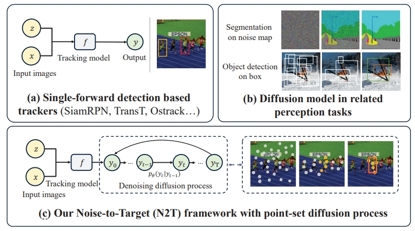
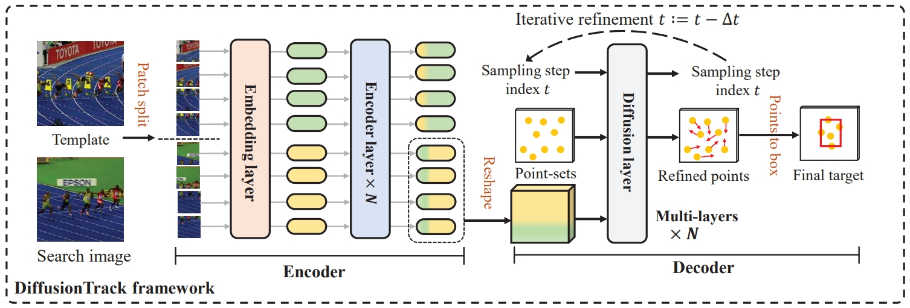
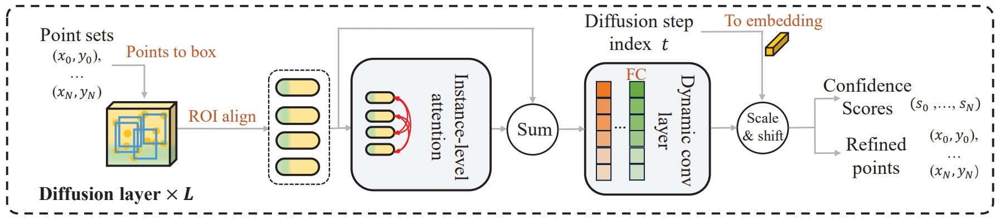

# DiffusionTrack: Point set Diffussion Model for Visual Object Tracking

```bibtex
Fei Xie, Zhongdao Wang, Chao Ma
```

:star: The official implementation for the CVPR2024 paper: [DiffusionTrack](https://openaccess.thecvf.com/content/CVPR2024/papers/Xie_DiffusionTrack_Point_Set_Diffusion_Model_for_Visual_Object_Tracking_CVPR_2024_paper.pdf).

## Abstract


Existing Siamese or transformer trackers commonly pose visual object tracking as a one-shot detection problem, i.e., locating the target object in a \textbf{single forward evaluation} scheme. Despite the demonstrated success, these trackers may easily drift towards distractors with similar appearance due to the single forward evaluation scheme lacking self-correction. To address this issue, we cast visual tracking as a point set based denoising diffusion process and propose a novel generative learning based tracker, dubbed DiffusionTrack. Our DiffusionTrack possesses two appealing properties: 1) It follows a novel noise-to-target tracking paradigm that leverages \textbf{multiple} denoising diffusion steps to localize the target in a dynamic searching manner per frame. 2) It models the diffusion process using a point set representation, which can better handle appearance variations for more precise localization. One side benefit is that DiffusionTrack greatly simplifies the post-processing, e.g., removing the window penalty scheme. Without bells and whistles, our DiffusionTrack achieves leading performance over the state-of-the-art trackers and runs in real-time.

## Highlights
### A Generative paradigm




DiffusionTrack has an encoder-decoder structure. The encoder extracts target-aware features and feeds search
features into the decoder. The decoder, comprising of a stack of diffusion layers, refines the point set groups to localize the target.




Details of a diffusion layer. It consists of three components: 1) Global instance layer: it produces target proposals in a generative
style and models the instance-level relationship. 2) Dynamic conv layer: it performs dynamic convolution with instance features. 3)
Refinement layer: it refines the point sets and estimates corresponding confidence scores

## Install the environment
```
conda create -n seqtrack python=3.8
conda activate diffusintrack
bash install.sh
```
Our codebase is built on top of [Detectron2](https://github.com/facebookresearch/detectron2/blob/main/INSTALL.md#installation), you need install detectron2 first. 

```
git clone https://github.com/facebookresearch/detectron2.git
python -m pip install -e detectron2
```

* Add the project path to environment variables
```
export PYTHONPATH=<absolute_path_of_DiffusionTrack>:$PYTHONPATH
```

## Data Preparation
Put the tracking datasets in ./data. It should look like:
   ```
   ${SeqTrack_ROOT}
    -- data
        -- lasot
            |-- airplane
            |-- basketball
            |-- bear
            ...
        -- got10k
            |-- test
            |-- train
            |-- val
        -- coco
            |-- annotations
            |-- images
        -- trackingnet
            |-- TRAIN_0
            |-- TRAIN_1
            ...
            |-- TRAIN_11
            |-- TEST
   ```
## Set project paths
Run the following command to set paths for this project
```
python tracking/create_default_local_file.py --workspace_dir . --data_dir ./data --save_dir .
```
After running this command, you can also modify paths by editing these two files
```
lib/train/admin/local.py  # paths about training
lib/test/evaluation/local.py  # paths about testing
```

## Train DiffusionTrack
```
python -m torch.distributed.launch --nproc_per_node 8 lib/train/run_training_diffusiontrack.py --script diffusiontrack --config diffusiontrack_b256 --save_dir ./output/diffusiontrack_b256
```


## Test and evaluate on benchmarks

- LaSOT
```
python tracking/test.py diffusiontrack diffusiontrack_b256 --dataset lasot --threads 2
python tracking/analysis_results.py # need to modify tracker configs and names
```
- GOT10K-test
```
python tracking/test.py seqtrack diffusiontrack_b256_got --dataset got10k_test --threads 2
python lib/test/utils/transform_got10k.py --tracker_name diffusiontrack --cfg_name diffusiontrack_b256_got
```
- TrackingNet
```
python tracking/test.py diffusiontrack diffusiontrack_b256 --dataset trackingnet --threads 2
python lib/test/utils/transform_trackingnet.py --tracker_name diffusiontrack --cfg_name diffusiontrack_b256
```

- UAV123
```
python tracking/test.py diffusiontrack diffusiontrack_b256 --dataset uav --threads 2
python tracking/analysis_results.py # need to modify tracker configs and names
```


## Test FLOPs, Params, and Speed
```
python tracking/profile_model.py --script diffusiontrack --config diffusiontrack_b256
```


## Acknowledgement
* This codebase is implemented on  [DiffusionDet](https://github.com/ShoufaChen/DiffusionDet), [SeqTrack](https://github.com/microsoft/VideoX), and [PyTracking](https://github.com/visionml/pytracking) libraries. 
We would like to thank their authors for providing great libraries.


## Citation
If our work is useful for your research, please consider citing:

```Bibtex
@InProceedings{Xie_2024_CVPR,
    author    = {Xie, Fei and Wang, Zhongdao and Ma, Chao},
    title     = {DiffusionTrack: Point Set Diffusion Model for Visual Object Tracking},
    booktitle = {Proceedings of the IEEE/CVF Conference on Computer Vision and Pattern Recognition (CVPR)},
    month     = {June},
    year      = {2024},
}
```
